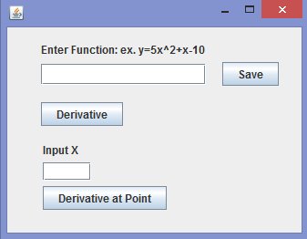
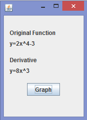
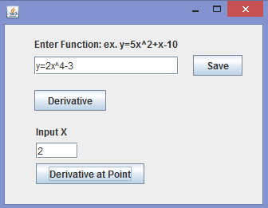
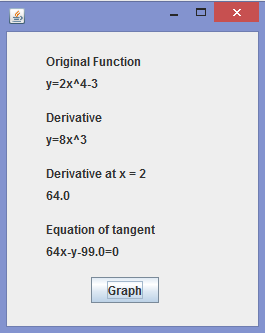
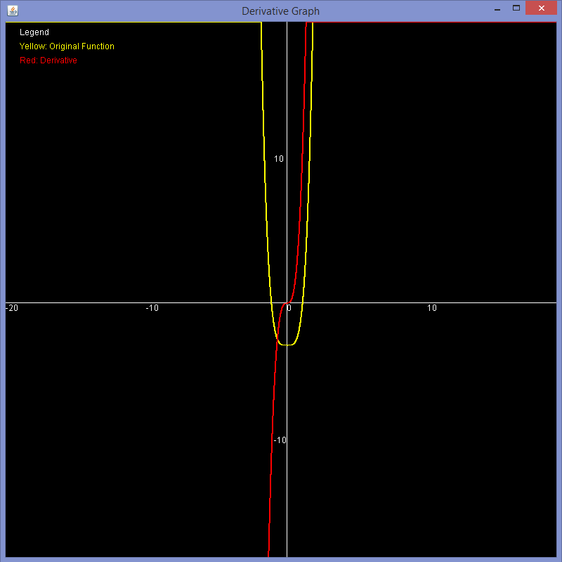

# Derivative-Helper
The Derivative Helper will derive any polynomials the user inputs and even graph it to give a visual aid. The user will input a function, such as y=3x^3+2x^2-x+6, in a GUI that will contain intuitive buttons to derive or graph it.

## Requirements
* NetBeans or any Java IDE

## Instructions
Simply open the "Derivative-Helper" project in NetBeans or other Java IDE and hit run.

## Features
1. Finding the Derivative
   - Derives the function by finding the new coefficients, exponents and remove the constant for the first derivative base on the user’s input and displays it in a new window.
2. Finding the Derivative at a point (tangent line)
   - Set up a loop to calculate the y-value at given x-value.
   - Using the derivative function calculate the slope of the tangent line at x-point.
   - Output a standard equation of the tangent line at the input x-value.
3. Graphing
   - The user will have the option of graphing both the original function and the derivative.
   - Loops through values of x to find y and plot points on graph.
   
## User Manual
1. Inputting the function
   - When the user runs the program, they will be greeted with this window. It is a very simple window with the first text field allowing the user to input the function following the format of from the highest exponents to the lowest exponents. Eg. y=5x^2+x-10 with no caps or spaces in between. The current program only handles with polynomials with negative exponents. After inputting the function into the text field, the user must click save to save the function in order for further calculations. 
   - 
2. Finding derivative
   - To find the derivative of the function, click the Derivative Button and a new window will open up.
   - 
   - This window will show the original function as well as its derivative and with the option to graph the two functions. Click the Graph Button to graph the two functions.
3. Finding derivative at a point
   - To find the derivative at a point simply input the desired x coordinate in the first window.
   - 
   - Then click the Derivative at Point Button and a new window will open up.
   - 
   - It will display the original function, derivative, the derivative at the desired point, and the standard equation of the tangent line. It also has the option to graph the two functions. 
4. Graph
   - Simply click the Graph Button to graph the two functions.
   - 

## Built With
* Java

## Author(s)
* Kevin Huang
* James Wu
